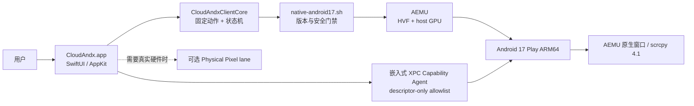

# CloudAndx 原生 macOS Android 客户端方案

> 决策日期：2026-08-12 
> 目标主机：Apple Silicon Mac（当前验证机为 M1 MacBook Pro） 
> 当前状态：架构确定；Phase 1 客户端 MVP 已完成；Phase 2A 桌面融合闭环实施中；Phase 2B 已嵌入 descriptor-only XPC Agent。development-sdk 仍依赖本机 SDK；最终发行 App 才会内嵌 source-built ARM64 AEMU+AOSP，用户无需 Android Studio、Android SDK 或单独模拟器。

## 1. 决策

CloudAndx 将从“Docker 中运行 Android”转为“macOS 原生客户端管理 Android”。客户端的
Android 执行内核采用 Google 官方 Android Emulator（AEMU）ARM64，直接使用
Hypervisor.Framework 和宿主 GPU；产品层由 CloudAndx 自己实现。

这不是给现有脚本简单套一层按钮。最终产品由三条能力链组成：

1. **本机体验链**：AEMU + HVF + gfxstream/host GPU，负责日常应用运行、低延迟显示和输入。
2. **CloudAndx 产品链**：生命周期、快照预热、设备画像、输入映射、文件/剪贴板、音视频、
   自动化、性能观测和按应用兼容策略。
3. **真机补全链**：物理 Pixel，承接基带、TEE/StrongBox、Widevine L1、硬件级
   Play Integrity、真实相机 ISP 等虚拟设备不能诚实提供的能力。

不采用以下方向作为主线：

- 不在 OrbStack、Docker 或 Apple `container` 内继续寻找 M1 嵌套硬件加速。
- 不从零实现 `Virtualization.framework + AOSP` Android VM；这需要重建 virtio 设备、HAL、
  GPU、音视频、输入、快照和调试生态，无法比成熟 AEMU 更快达到高质量。
- 不把本地虚拟设备宣称成具有真实安全硬件、射频和认证能力的物理手机。

## 2. “超越模拟器、接近真机”的可验收定义

“真机体验”必须拆成两个目标，否则项目永远无法验收：

| 目标 | 是否可由客户端达成 | 验收方式 |
| --- | --- | --- |
| UI 流畅、输入跟手、应用秒开、声音连续 | 可以 | 帧时间、输入延迟、启动耗时、丢帧与 underrun 指标 |
| 快照秒恢复、宿主文件/剪贴板/摄像头/麦克风/手柄融合 | 可以 | 端到端功能和恢复测试 |
| Android Framework、Play Store/GMS 与 ARM64 应用兼容 | 可以，受镜像与 Google 服务政策约束 | 固定 Google Play AVD + 应用回归集 |
| 真实基带、eSIM/IMS、NFC 安全元件、UWB | 不可以 | 路由到物理设备 |
| TEE/StrongBox、Widevine L1、硬件级 Play Integrity | 不可以 | 路由到物理设备，不伪造结果 |
| 真实相机 ISP、物理传感器噪声、真实功耗/温控 | 不可以完整复现 | 模拟用于开发；物理设备用于最终验收 |

因此产品目标不是“伪装成真机”，而是：**本机交互体验优于常见桌面模拟器，并通过统一的
物理设备入口补齐不可虚拟化能力。**

## 3. 总体架构

下图使用 Frost Clean 分层样式。AEMU 是执行内核，CloudAndx Client 是产品与安全边界；
Docker compatibility 不参与本机性能链。

CloudAndx Native Android Workbench

用户体验层 · SwiftUI / AppKit

设备工作台 <small>启动、状态、日志</small>

Android 画面 <small>原生窗口 / 低延迟 View</small>

输入工作台 <small>键鼠、触控板、手柄</small>

应用中心 <small>安装、深链、场景模板</small>

↓ 固定类型命令与本机事件，不接受任意 shell

CloudAndx 本机控制层 · fail-closed

Runtime Supervisor <small>单实例状态机</small>

Capability Bridge <small>ADB / Console / gRPC allowlist</small>

Profile Engine <small>设备与应用策略</small>

Telemetry <small>帧时间、输入 RTT、ANR</small>

↓ 版本锁、回环监听、能力门禁

本机 Android 执行层 · 当前已验证

Google AEMU 37.1.11 <small>ARM64 + Hypervisor.Framework</small>

gfxstream / host GPU <small>本机直接呈现，不经过 Docker</small>

Android 17 Play ARM64 r06 <small>Pixel 9 / 16 KiB page</small>

宿主能力融合

Clipboard / Files

Camera / Microphone

Audio / Gamepad

Snapshots / Warm State

可选真机补全层 · 不冒充本地虚拟设备

Physical Pixel

硬件安全与 DRM

射频 / ISP / 物理传感器

### 3.1 进程与信任边界

客户端不能拼接 shell 字符串。所有运行操作必须映射到固定枚举：`start`、`stop`、
`restart`、`status`、`scrcpy`、`snapshot-save`、`snapshot-resume` 和
`snapshot-status`。脚本继续负责版本锁、停止 Docker Android、HVF 检查、loopback
listener 门禁、launchd 生命周期、可信快照身份和失败清理。

## 4. 为什么核心选择 AEMU，而不是重写 VM

| 维度 | 官方 AEMU + CloudAndx 产品层 | 自研 Virtualization.framework + AOSP |
| --- | --- | --- |
| 当前可运行性 | 已在 M1 实测 Android 17、HVF、host GPU、scrcpy | 仓库无实现和运行证据 |
| 图形栈 | gfxstream、GLES/Vulkan、宿主 GPU 已集成 | 需自行实现/适配 virtio-gpu、renderer、HAL |
| 设备模型 | 摄像头、麦克风、传感器、GPS、电量、蜂窝模拟已有基础 | 每项都需 guest HAL 与 host bridge |
| 快照与 AVD | AEMU Quick Boot / snapshot 生态 | 需解决 VM、磁盘、GPU、Android 服务一致性 |
| Google Play 测试 | 官方 Google Play AVD | 自建 AOSP guest 不能等同 Google Play 镜像 |
| 维护风险 | 版本锁与兼容回归 | 长期跟随 AOSP kernel/framework/HAL 演进 |
| 产品差异化 | 投入体验、自动化、兼容性和真机路由 | 大量投入被虚拟化底座消耗 |

Apple 的 Hypervisor.framework 是低级虚拟化接口，Virtualization.framework 的官方 guest
模型面向 Linux/macOS；它们不会自动提供 Android 所需的 GPU、HAL 和设备模型。AEMU 已经
在 macOS 上把这些工作连接到 Hypervisor.Framework。重新实现不会获得额外的 M1 GPU
直通，反而丢失成熟兼容层。

## 5. 客户端模块

### 5.1 Phase 1 已定义模块

| 模块 | 职责 | 边界 |
| --- | --- | --- |
| `CloudAndxClientCore` | 项目定位、固定命令、子进程执行、状态解析、有限输出 | 不依赖 SwiftUI，可单测 |
| `CloudAndxClient` | 设备卡片、启动/停止/重启、日志、能力说明 | 不接受用户输入命令行 |
| `native-android17.sh` | 实际 runtime 权威入口 | 继续 fail-closed，不被 GUI 绕过 |
| AEMU/scrcpy window | 当前低延迟画面和输入 | 必须连接同一个 AVD |

### 5.2 Phase 2 本机 Capability Bridge

Phase 2 将 Docker Device Bridge 的“鉴权 + allowlist”思想迁移到本机，但不会把容器 HTTP
服务原样搬到宿主。Phase 2A 在 `CloudAndxClientCore` 内先实现进程内、固定二进制和固定参数
的结构化动作，便于当前未签名 MVP 验证完整体验。当前开发 app 已迁移为 app-owned XPC
service：SwiftUI 不直接执行 runner，用户文件仅以已打开的 `FileHandle` 跨 XPC；agent 不接收
bookmark、host path、shell 或 ADB 参数。开发 ad-hoc 门禁仅为同用户/同 app path 弱身份，发布仍需 Team-ID requirement：

- `installAPK(FileHandle)`、`pushFile(FileHandle, destinationClass)`、`captureScreenshot(FileHandle)`；
- 未来能力：`launchApp(package)`、`stopApp(package)`、`pullFile(allowlistedPath)`；
- `setClipboard(text)`、`readClipboard()`；
- `tap`、`swipe`、`key`、`text`、`rotate`；
- `setLocation`、`setBattery`、`setNetworkProfile`；
- `captureScreenshot`、`startRecording`、`collectDiagnostics`。

当前 bridge 以及未来能力扩展都只执行固定二进制与参数数组，不暴露任意 ADB、shell、
gRPC 或 Emulator Console。Android 17 r06 实测没有公开 `cmd clipboard` 实现，Phase 2A 不以
`input text` 冒充剪贴板；剪贴板同步在审计 scrcpy control protocol 或引入签名 companion
后再启用。

### 5.3 生命周期

客户端自动刷新只读取 `status` 与日志，不自动启动 Android 或打开 scrcpy。显式启动使用
`KeepAlive=false` 的 LaunchAgent：AEMU（`sdk_gphone16k_arm`）是原生 AEMU 窗口；它正常或
异常退出后不会由 launchd 重生，只有明确的 start/restart/snapshot-resume 才会再次创建实例。
scrcpy 只接受已 ready 的实例，绝不隐式启动或停止 Android，因此不会与生命周期操作竞争。
当前 Capability Agent 是 App Sandbox XPC descriptor/FD 边界；它不能安全执行开发 checkout
的 runner 或写 `.runtime`，所以 sandboxed authority 失败关闭，直到 bundle-owned runtime 或
单独审计的 helper 被设计完成。发布同样保持 fail-closed。

## 6. 显示与输入策略

### 6.1 阶段选择

| 阶段 | 显示路径 | 原因 |
| --- | --- | --- |
| MVP | AEMU 原生窗口；同实例 scrcpy 4.1 作为专注模式 | 已验证、无额外远程链、最快交付 |
| Phase 2 | CloudAndx 管理窗口 + AEMU 专用显示窗口，统一焦点/快捷键/窗口布局 | 不依赖未公开的 AEMU 嵌入 API |
| Research Gate | 审计 AEMU 前端/renderer，验证 IOSurface/Metal 零拷贝 View 的可维护性 | 只有证据证明端到端收益才进入产品 |
| 远程 | VideoToolbox 硬件编码 + WebRTC | 单独链路，不污染本地零网络跳转路径 |

本地首选直接呈现，而不是把 AEMU 帧编码后再解码到自己的窗口。一个“看起来更统一”但增加
视频编解码、拷贝和输入转译的嵌入窗口，可能比官方窗口更慢，不满足本项目目标。

### 6.2 输入语义

- 触控板：单指触控、连续滑动、惯性曲线和取消事件必须形成完整 Android pointer 序列。
- 鼠标：提供 Android 指针和绝对触控两种模式；应用 profile 记录选择。
- 键盘：文本输入和物理按键分离；组合键不能误发给 Android。
- 手柄：按设备 GUID 保存布局、死区、曲线和振动策略。
- 所有坐标在窗口缩放、旋转、刘海/圆角 inset 后统一映射；禁止多级无状态换算。

## 7. 真机感知能力

| 能力 | 主实现路径 | 失败策略 |
| --- | --- | --- |
| 音频输出 | AEMU host audio；Phase 2 加端到端延迟/underrun 指标 | 设备切换后重建，不静默无声 |
| 麦克风 | 显式授权后映射宿主输入 | 未授权时向 UI 明示，不伪造权限 |
| 摄像头 | AEMU host camera / virtual scene；按应用 profile 选源 | 设备不支持时使用确定性虚拟场景 |
| 剪贴板 | 结构化同步，支持暂停和敏感模式 | 密码管理器/敏感 app 默认不自动同步 |
| 文件 | macOS security-scoped bookmark + allowlist 目标目录 | 不暴露宿主任意文件系统 |
| 通知 | Android 通知镜像到 macOS，可单应用关闭 | 不记录敏感通知正文 |
| 传感器/GPS | Emulator gRPC/Console allowlist + 场景回放 | 明确标识模拟值 |
| USB/真机 | 独立 Physical Pixel lane | 不把宿主 USB 任意透传给虚拟 guest |

## 8. 快照、预热与持久化

要从当前 18.2 秒冷启动提升到“点开即用”，优先顺序是：

1. 保留当前完整冷启动作为可信基线和恢复路径。
2. 引入固定名 clean snapshot；保存前等待 Android idle、同步数据并记录 runtime/image/config 身份。
3. snapshot 仅在 Emulator、system image、AVD config、GPU mode 完全匹配时恢复；否则失败关闭并冷启动。
4. 支持一个预热但不显示的本机实例状态；仍遵守“同一时间只有一个 Android 实例”。
5. 用户数据与 clean snapshot 分层；重置设备不删除用户明确导出的文件。

目标：warm resume P50 ≤ 2 秒、P95 ≤ 4 秒；冷启动 P95 ≤ 25 秒。快照门禁必须覆盖恢复后
SystemServer、SurfaceFlinger、GMS、网络、音频和输入，而不只检查 `sys.boot_completed=1`。

## 9. 性能目标与证据

“比市面模拟器快”必须通过同机、同应用、同场景对照才能声明。当前先建立内部 SLO：

| 指标 | Phase 1 基线 | Phase 2 目标 |
| --- | --- | --- |
| 冷启动到 ready | 已测 18.2 秒 | P95 ≤ 25 秒 |
| warm snapshot 到可输入 | 已验证：运行中恢复 7.38 秒；停止态 AEMU load 3.618 秒、端到端 ready 11.93 秒 | P50 ≤ 2 秒，P95 ≤ 4 秒（当前未达标） |
| 本地显示刷新 | 已证实 60 Hz display | 前台稳定 60 FPS；90/120 仅硬件与 guest 支持时开放 |
| 输入到呈现延迟 | 尚未测量 | P95 ≤ 35 ms，必须用高速相机/事件时间线校准 |
| Android 语言页启动 | 已测 564–1113 ms | P95 ≤ 1.2 秒 |
| 长稳 | 尚未建立客户端证据 | 8 小时无 runtime crash、无持续音频/输入失联 |
| 恢复 | 脚本失败清理已覆盖 | 客户端/agent crash 后 10 秒内恢复权威状态 |

对外“超越某产品”的结论只有在建立固定竞品版本、同一 Mac、电源模式、分辨率、应用和
测量工具的 benchmark 后才允许发布；产品路线不依赖无法证明的营销比较。

## 10. 安全与隐私

- ADB 和 Emulator gRPC 保持 loopback-only；客户端不增加 `0.0.0.0` 监听。
- 客户端固定调用仓库脚本，不以 `/bin/sh -c` 执行用户文本。
- 麦克风、摄像头、通知、剪贴板、文件目录使用 macOS 明确授权；UI 持续显示启用状态。
- 日志默认去除 token、ADB key、路径 bookmark 和敏感剪贴板内容。
- 本机 agent 采用 XPC/codesigning 身份和结构化 allowlist；不提供通用 shell API。
- Docker compatibility profile 继续隔离，客户端不自动启动它，也不修改 VPN、DNS、路由或防火墙。
- 物理设备与虚拟设备必须有不可混淆的身份标识，能力证明分别保存。

## 11. 分阶段实施路线

### Phase 1：原生客户端 MVP

- SwiftUI/AppKit 应用和可测试 Core 模块；
- 启动、停止、重启、状态、日志和打开 Android；
- App-Sandboxed agent 当前不定位 development checkout；release 仅可使用 bundle-relative runtime，生命周期 helper 仍是单独设计门禁；
- 固定命令、无 shell 拼接、有界输出、忙状态和错误反馈；
- 构建/单测以及现有 native runtime contract 回归。

退出条件：客户端能在当前 M1 上启动同一 Android 17 AVD，脚本安全门禁未被绕过；失败时
显示可执行错误，客户端退出不会误杀由 launchd 管理的 Android。

### Phase 2：真机级桌面体验

- Phase 2A：可信固定快照、APK 安装、Download 文件投递、PNG 截图；
- Phase 2B：自包含 ARM64 runtime manifest、来源/SBOM/NOTICE 闭环、开发期嵌入式 XPC Capability Agent 与可信书签 descriptor-only 边界；主 app 负责 security-scoped bookmark 并只向 agent 传已打开的 `FileHandle`，agent 不接收任意 host path/bookmark。发布签名、公证和 payload 仍由 provenance/identity 门禁阻断；
- Phase 2C supply chain：离线 source-lock/source-evidence/toolchain-evidence、RSA
  builder attestation、精确 manifest closure 和独立重验。生产 trusted-builders
  policy 当前固定为零 key，因此 release fail-closed；此管道不证明真正可再分发
  的 macOS AEMU/gfxstream/adb closure 已完成或获法律批准。
- Phase 2D embedded display：必须单独证明低延迟、真正嵌入的客户端画面；外置
  scrcpy 或 AEMU 窗口不能作为该项验收证据。
- 后续能力：通知、摄像头、麦克风、音频设备切换；
- 快照秒开、设备/应用 profile、键鼠/触控板/手柄映射；
- 帧时间、输入 RTT、ANR、崩溃和音频 underrun HUD；
- 8 小时长稳与权限恢复测试。

工具链清理门禁：当前本机 macOS 27 SDK 与 Swift driver revision 不完全一致，SwiftPM
默认 backend 仍会以 `Unknown error parsing property list` 失败；MVP 包装脚本暂用 legacy
native backend。更新到版本完全匹配的 Xcode/Command Line Tools 后，应先验证默认 backend，
再删除兼容参数；不能把已弃用 backend 当成长期构建架构。

### Phase 3：CloudAndx 低延迟显示与远程

- 先验证 AEMU renderer → IOSurface/Metal 的公开性、零拷贝程度、许可证和升级成本；
- 只有实测优于 AEMU 原生窗口/scrcpy，才实现内嵌 View；
- 远程单独使用 VideoToolbox + WebRTC + 身份网关，复用同一输入语义和同一 Android；
- 不为浏览器恢复 noVNC sidecar，也不向远程用户开放 ADB/gRPC。

### Phase 4：真机能力补全

- 接入受控 Physical Pixel；
- 建立能力路由：虚拟 Android 处理高性能日常工作，真机处理安全硬件/射频/DRM/ISP；
- UI 统一，但设备身份、证据和风险提示不统一冒充。

## 12. 当前项目复用点

| 路径 | 客户端用途 |
| --- | --- |
| `scripts/native-android17.sh` | 当前 runtime 权威入口：版本、AVD、HVF、GPU、launchd、loopback、单实例 |
| `.runtime/native-android17/` | AVD、PID、日志与项目隔离状态；不提交 Git |
| `services/device-bridge/` | Phase 2 allowlist 语义参考，不直接暴露为宿主通用 HTTP shell |
| `tests/native-macos-runtime-*.sh` | 生命周期与安全回归基线 |
| `contracts/android-*.schema.json` | 镜像与能力证据模型 |
| `docs/android-17-acceptance-contract.md` | 证据晋级原则与真机/虚拟设备边界 |

## 13. 官方依据

- Android Emulator 在 Apple Silicon 上使用 VM acceleration，且加速 Emulator 必须直接运行
  于宿主而非另一 VM/Docker：
  [Android Emulator acceleration](https://developer.android.com/studio/run/emulator-acceleration)。
- AEMU 命令行、摄像头、Extended Controls 和快照能力：
  [命令行](https://developer.android.com/studio/run/emulator-commandline)、
  [摄像头](https://developer.android.com/studio/run/emulator-use-camera)、
  [Extended Controls](https://developer.android.com/studio/run/emulator-extended-controls)、
  [Snapshots](https://developer.android.com/studio/run/emulator-snapshots)。
- Apple Hypervisor.framework / Virtualization.framework 是通用虚拟化框架：
  [Hypervisor](https://developer.apple.com/documentation/hypervisor)、
  [Virtualization](https://developer.apple.com/documentation/virtualization)。
- Apple `container` 基于轻量 Linux VM；嵌套虚拟化要求 M3 或更新硬件，不能解决当前 M1
  路线：[`container`](https://github.com/apple/container)。
- Cuttlefish 适合未来 Linux/KVM 节点，不是当前 macOS 本机最短路径：
  [Cuttlefish](https://source.android.com/docs/devices/cuttlefish)、
  [Cuttlefish GPU acceleration](https://source.android.com/docs/devices/cuttlefish/gpu)。
