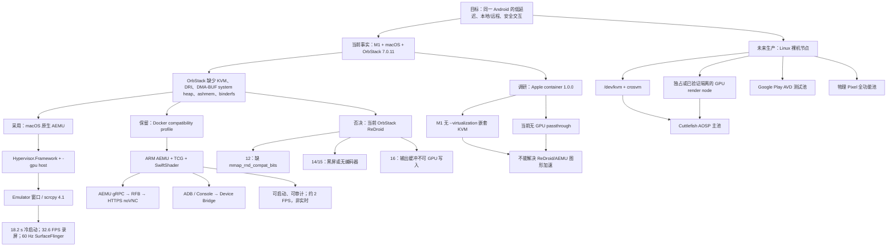
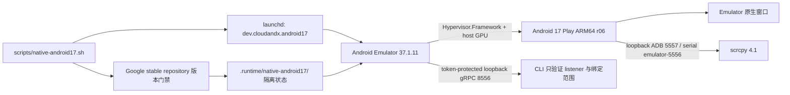
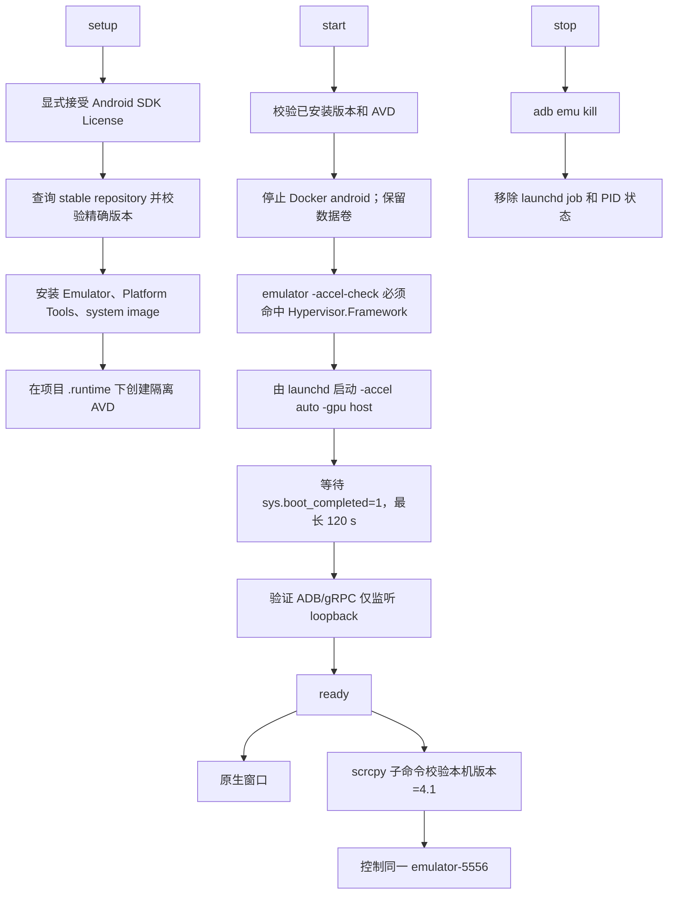
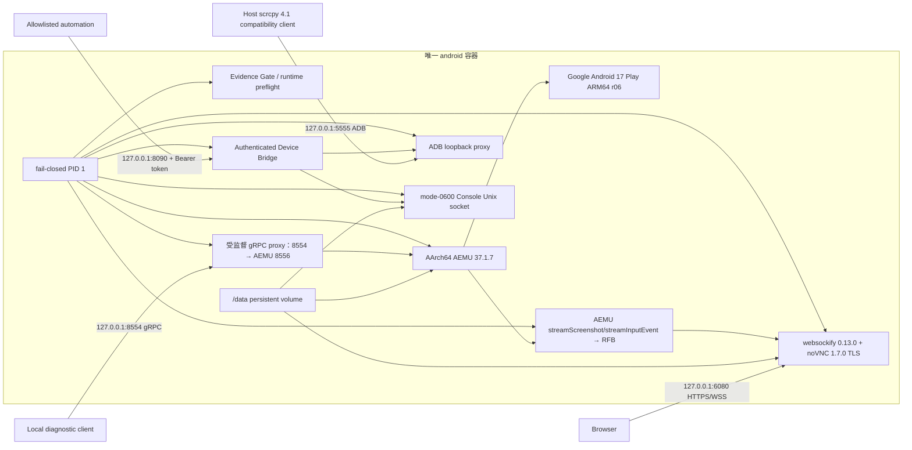
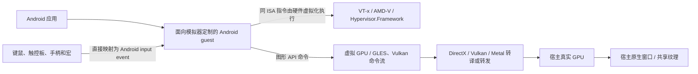
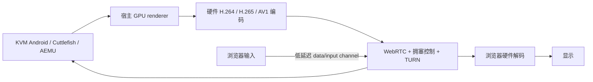
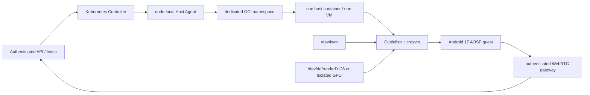

# CloudAndx Android 项目总结、知识图谱与决策记录

> 快照日期：2026-08-12<br>
> 所总结的实现基线：`main` / `d9c8759`（原生客户端工作从该基线继续）<br>
> 当前主机：Apple M1 MacBook Pro，OrbStack 7.0.11<br>
> 文档目的：把当前实现、历史探索、实测证据、失败原因和后续演进路线放在同一个事实入口中。

## 1. 一页结论

CloudAndx 的目标不是“让任意 Android 进程勉强出现在容器里”，而是在不暴露宿主控制面、
不修改本机网络、并保持制品可追溯的前提下，提供同一台 Android 的本机与远程交互能力。

截至当前基线，结论分为三层：

| 层级 | 状态 | 结论 |
| --- | --- | --- |
| M1 本机低延迟交互 | **已实现，默认路径** | macOS 原生 Android Emulator 通过 Hypervisor.Framework 和宿主 GPU 运行 Android 17 ARM64 AVD；使用 Emulator 原生窗口或 scrcpy 4.1。 |
| OrbStack Docker 兼容与证据回溯 | **已实现，显式 profile** | 单个 `android` 容器运行 Android 17 ARM64 AEMU，但 CPU 为 TCG、GPU 为 SwiftShader；保留可重建性、远程界面和安全门禁，不承诺实时或原生等效。 |
| 多用户/生产级 Android 云 | **设计完成，尚未部署** | 目标是 x86_64 Linux 裸机 KVM 节点上的 Cuttlefish/crosvm；需要真实节点、GPU/KVM、安全、授权和长稳证据后才能从 `DESIGN_READY` 升级。 |

2026-08-12 起，默认本机路径进入产品化阶段：新增原生 macOS 客户端，以现有 AEMU/HVF/
host GPU 为执行内核，逐步实现快照预热、宿主能力融合、输入与应用 profile、性能观测和
物理 Pixel 能力路由。详细决策与验收指标见
[原生 macOS Android 客户端方案](native-macos-client-architecture.md)。

以下路线不属于当前可部署方案：

- 当前 M1 + OrbStack 上的 ReDroid 12/14/15/16：已复测失败，相关运行实现已删除。
- M1 上的 Apple `container` 硬件加速 Android：只完成调研，没有启动 PoC；M1 不支持其嵌套虚拟化，且 Apple `container` 当前没有 GPU passthrough。
- OrbStack 或 Docker VM 内的加速 AEMU/Cuttlefish：没有 `/dev/kvm`，且 Android 官方不支持在另一层 VM/Docker 中运行 VM 加速 Emulator。
- 把 Cuttlefish、Google Play AVD 或物理 Pixel 的能力互相冒充：三者的 GMS、HAL、认证和真实硬件边界不同。

## 2. 项目初衷与不可变约束

### 2.1 要解决的问题

1. 在 Apple Silicon 本机获得可日常使用的 Android UI、应用安装、调试和输入体验。
2. 为浏览器、scrcpy 和自动化控制提供同一 Android 实例，而不是多个画面相似的实例。
3. 让 Android 镜像、工具版本、构建来源、校验和及运行证据可以复现和审计。
4. 为未来迁移到 Linux KVM/Cuttlefish 生产节点保留清晰契约，而不把未验证设计写成已交付事实。

### 2.2 运行与安全约束

- Docker 远程拓扑最多只有一个 `android` 运行容器和一个最终运行镜像。
- AEMU、ADB 代理、Device Bridge、RFB bridge、websockify/noVNC 和证据门禁由同一 fail-closed 入口监督。
- noVNC 固定为 1.7.0，websockify 固定为 0.13.0，并默认使用 HTTPS/WSS。
- scrcpy client/server 必须同版；当前本机固定 4.1，满足项目 `>= 4.0` 的基线。
- Compose 发布到宿主的 ADB、Emulator gRPC、noVNC 和 Device Bridge 端口只绑定
  `127.0.0.1`；raw RFB 只监听容器回环地址，不对局域网或公网直接发布。
- Device Bridge 只提供鉴权、白名单操作，不提供任意 shell、任意 ADB 或任意 Emulator Console 命令。
- 不暴露 Docker Socket、宿主 shell、容器 shell、KVM 设备或宿主网络管理能力给远程用户。
- 不修改 FlyLink、Clash Verge、VPN、DNS、路由、防火墙或 OrbStack 网络配置；已确认本项目的性能根因与这些网络无关。
- 同一时间只运行一个 Android 实例。启动原生运行时前会停止 Docker `android` 容器，但保留其数据卷。

### 2.3 “Google 原生”的准确含义

当前原生和 Docker AEMU 路径使用 Google 发布的 Android 17 Google Play AVD 软件栈，
可以提供 Google System UI、Framework、Play Store 和 Play services，但它仍是虚拟设备。
真实运营商基带/eSIM/IMS、NFC 安全元件、UWB、相机 ISP、TEE/StrongBox、硬件级
Play Integrity、Widevine L1 和 Pixel 专属硬件/AI 能力不能由单个模拟器或容器完整替代。

## 3. 总体知识图谱



图中的“采用”“保留”“否决”“未来”是状态，而不是性能排序：

- **采用**：当前主机已实测并作为默认入口。
- **保留**：代码可重建且有契约测试，但只承担兼容和证据用途。
- **否决**：已取得足以停止投入的反证；除非宿主能力变化，否则不重复探索。
- **未来**：架构和验收契约已写好，但缺真实基础设施证据。

## 4. 当前默认实现：macOS 原生 Android 17

### 4.1 架构



### 4.2 固定身份

| 组件 | 固定值 |
| --- | --- |
| Android Emulator | 37.1.11 |
| Platform Tools | 37.0.1 |
| System image | `system-images;android-37.0;google_apis_playstore_ps16k;arm64-v8a` |
| System image revision | r06 |
| AVD device profile | Pixel 9 |
| scrcpy | 4.1 |
| CPU acceleration | Hypervisor.Framework |
| GPU | `-gpu host` / gfxstream |
| ADB | `127.0.0.1:5557`，serial 为 `emulator-5556` |
| Emulator gRPC | `127.0.0.1:8556`，启用 token |

### 4.3 生命周期流程



入口：

```sh
ACCEPT_ANDROID_SDK_LICENSES=yes scripts/native-android17.sh setup
scripts/native-android17.sh start
scripts/native-android17.sh status
scripts/native-android17.sh scrcpy
scripts/native-android17.sh stop
```

### 4.4 实测结果

- 冷启动完成：18.2 秒。
- Settings“语言与地区”5 次启动：564、595、716、982、1113 ms。
- 滑动录屏：102 帧 / 3.123 秒，约 32.6 FPS。
- SurfaceFlinger：1080 × 2424、60 Hz，有真实 Launcher/Input layer 和 device composition。
- scrcpy 4.1：H.264 视频与鼠标/键盘控制已验证。
- 生命周期：启动失败会清理 launchd 状态；已经运行时仍会重新验证 loopback 监听。

当前原生路径没有 noVNC。浏览器入口仍属于 Docker compatibility profile；如果未来要让
浏览器控制原生 AVD，必须新建带 token 的宿主代理，并重新完成未授权访问、输入、重连、
敏感信息和跨主机发布验收，不能直接暴露宿主 ADB 或 gRPC。

## 5. 当前兼容实现：单容器 Docker Android 17

### 5.1 运行边界

默认 `docker compose` 不启动 Android。只有显式选择 `docker-compat` profile 才会展开一个
名为 `android` 的运行服务：

```sh
ACCEPT_ANDROID_SDK_LICENSES=yes docker compose --profile build build native-engine
ACCEPT_ANDROID_SDK_LICENSES=yes docker compose --profile docker-compat up -d --build
```

`native-engine` 是 build profile 的制品载体，不是运行 sidecar。最终运行时始终只有一个
`android` 容器和一个最终镜像 `cloudandx/android17-play-emulator:37.0-r06`。

### 5.2 单容器数据与控制流



### 5.3 为什么这个 Docker 路径很复杂

Google 的 Linux Emulator SDK 用户态主要以 x86_64 形式发布，而 OrbStack Docker Engine
是 ARM64，且不提供嵌套 KVM。项目因此没有让 x86 launcher 运行 ARM AVD，也没有做整套
qemu-user 双重翻译，而是：

1. 从锁定的 Android Emulator 官方源码构建 AArch64 headless engine。
2. 将 AArch64 loader、共享库、gfxstream、SwiftShader 和 runtime data 打包成可迁移闭包。
3. 直接执行 native AArch64 child，让 `/proc/<pid>/exe` 可以证明真实 engine 身份。
4. 在无 KVM 时锁定 `GICv2 + android-a57-16k + TCG`，拒绝调用者注入第二个 `-qemu` 尾部。
5. 保留 Google 签名的 system/vendor/GMS user-build 分区；下载前校验官方 SHA-1。
6. 为极慢 TCG 的 framework、ART Finalizer 和 Bluetooth HCI watchdog 创建确定性的派生 boot ramdisk；原始和派生摘要都被记录并验证。
7. 用事件驱动 AEMU gRPC 帧流替代无法及时产出首个 H.264 帧的容器内 scrcpy/X11 浏览器链。

这条路线证明了“ARM-only Docker 中可以启动固定 Google Android guest”，但也证明了
软件 CPU 与软件 GPU 是主要瓶颈。它不应继续作为本机体验优化的主战场。

### 5.4 远程交互实现

- AEMU `streamScreenshot` 提供事件驱动 RGB 帧，不使用截图轮询。
- `aemu-rfb-bridge.py` 把帧转为 RFB，并把鼠标 DOWN/MOVE/UP、键盘和文本写回同一 AEMU `streamInputEvent`。
- raw RFB 只在容器回环 `5900` 监听，不映射到宿主。
- websockify/noVNC 通过 `6080` 提供 HTTPS/WSS；首次需要接受持久化自签证书。
- noVNC 固定 `resize=scale`、关闭 `view_only`，并把 Mac 触控板滚动转换为连续 Android 单指滑动。
- 指针移动按浏览器动画帧合并，轨迹分步消费，UP 前刷新最后坐标，减少突发 gRPC 输入和跳点。
- 帧和触摸都使用左上角原点；只有第一张真实、尺寸正确的 AEMU 帧到达后才通过浏览器健康门禁。

曾经使用“container scrcpy → Xvfb/Openbox/x11vnc → noVNC”的实现。它完成了坐标、点击、
拖动、触控板和重连修复，但在 ARM TCG 上 scrcpy 无法在健康窗口内产出第一个 H.264 帧，
因此当前实现改为 AEMU gRPC/RFB bridge。历史实现已经从当前运行路径移除。

### 5.5 Device Bridge 与证据门禁

Device Bridge 提供以下受限能力：

- 设备状态、截图、应用列表、logcat；
- APK 安装/卸载、启动/停止应用；
- 触控、按键、文本、旋转；
- GPS、短信、来电、网络、电量等固定 Emulator Console 操作；
- 重启和健康检查。

写操作需要 `Authorization: Bearer` token。Console 只通过
`/data/runtime/console/console.sock` 访问，token 位于
`/data/runtime/secrets/token`；两者都在同一个 `android` 容器和同一个持久卷中。

Evidence Gate 与 runtime preflight 负责启动前的制品与策略门禁：

- Google repository package path、stable channel、revision、URL 和 checksum；
- AArch64 engine、loader、依赖闭包、源码锁、补丁集和派生 ramdisk 身份；
- 软件执行/KVM 选择、架构门禁和 preflight 证据的原子写入。

`healthcheck.sh` 和 Device Bridge deep health 负责运行后的 guest/交互门禁：API 37、ARM64
ABI、16 KiB page size、Play Store、GMS、SystemServer、核心 Binder 服务、ADB/boot 状态，
以及浏览器需要的第一张真实 AEMU 帧。

### 5.6 安全属性

- runtime root filesystem 只读，uid/gid 为 10001。
- `cap_drop: ALL`，`no-new-privileges:true`，不使用 `--privileged`、host network 或宿主设备。
- 宿主只发布 `127.0.0.1:5555/8554/8090/6080`。
- Console Unix socket 和 token 为 mode `0600`；不会把 token 写入镜像、URL 或日志。
- raw RFB、容器内部 ADB、Console TCP 和 Docker API 不对浏览器开放。
- 任一被监督的关键进程退出，容器整体失败关闭，而不是保留一个看似可用的空页面。

### 5.7 已知性能边界

| 观测项 | Docker ARM TCG/SwiftShader | 原生 macOS AEMU |
| --- | --- | --- |
| Android 冷启动 | 历史约 383–401 秒；首次数据初始化可达约 25 分钟 | 18.2 秒 |
| Settings 语言页 | 超过 60 秒 | 564–1113 ms |
| 画面产出 | 约 2 FPS | 录屏约 32.6 FPS；显示 60 Hz |
| 适用范围 | 构建、兼容、证据、低频诊断 | 日常开发和交互 |

`https://127.0.0.1:6080/` 与 Mac 上直接打开 Emulator 的效果不同，根因不在 noVNC 页面
样式本身，而在其上游是 TCG + SwiftShader 的 Docker Android；noVNC 只能传输已有帧，
不能补出缺失的 CPU/GPU 硬件加速。

`https://android.cloudandx-android.orb.local/` 不是项目声明的 noVNC 入口；根路径返回
`NOT_FOUND` 不等于 Android guest 已经启动或失败。只有 `docker-compat` 运行并通过首帧门禁后，
受支持的浏览器入口才是带 `6080` 端口的 noVNC `vnc.html` URL。

## 6. 商业 Android 模拟器为何能接近真机体验

这里的“接近真机”指用户可感知的启动、动画、游戏帧率和输入延迟接近手机，并不表示模拟器
拥有真实手机的射频、安全芯片、相机 ISP 或设备认证。国内常见桌面模拟器的完整内部实现多为
闭源；以下内容将厂商公开配置、Android 官方机制与通用虚拟化工程原理分开表述，不把合理推断
写成某个厂商已经公开确认的实现细节。

### 6.1 核心不是 Docker，而是宿主原生加速栈

高性能桌面模拟器通常直接运行在 Windows 或 macOS 宿主上，CPU、GPU、显示和输入形成一条
短链路：



这条链路有两个不可替代的性能支点：

1. **CPU 硬件虚拟化**：guest 与宿主 ISA 匹配时，大部分普通指令直接在物理 CPU 上执行，
   Hypervisor 只处理特权操作、地址转换和虚拟设备访问。
2. **GPU 命令转发或转译**：Android 的 GLES/Vulkan 调用被送到宿主 DirectX、Vulkan 或
   Metal 后端，由真实 GPU 渲染，而不是由 CPU 逐像素计算。

Android 官方把 VM acceleration 和 graphics acceleration 明确定义为两个独立加速面；没有
Hypervisor 时 Emulator 只能逐块翻译 guest 机器码，`-gpu swiftshader` 也明确属于软件渲染。
官方同时说明 VM 加速 Emulator 必须直接运行在宿主机，不能嵌套在 Docker 或另一台 VM 中。
详见 [Android Emulator 硬件加速说明](https://developer.android.com/studio/run/emulator-acceleration)。

夜神公开要求开启 VT，并提供 OpenGL+、DirectX、ASTC、渲染缓存和最高 120 FPS 等设置；
这些配置能够证明产品依赖 CPU 虚拟化和宿主图形后端，但不能据此推断其未公开的具体 VMM、
驱动或内部协议。详见[夜神性能设置](https://support.yeshen.com/zh-CN/function/xn)。

### 6.2 CPU 路径：硬件虚拟化与同架构执行

典型 Windows 模拟器使用 Intel VT-x、AMD-V，或与 Windows Hypervisor Platform/自有
Hypervisor 集成。Apple Silicon 产品则需要直接使用 macOS 虚拟化能力，并让 ARM64 Android
guest 在 ARM64 CPU 上执行。

```text
商业本地模拟器 / CloudAndx native：
Android guest → Hypervisor → 物理 CPU

CloudAndx docker-compat：
Android guest → AEMU TCG 软件翻译 → OrbStack Linux VM → Hypervisor.Framework → 物理 CPU
```

第二条链路虽然 guest 和最终物理 CPU 都是 ARM64，中间的 OrbStack VM 没有向 AEMU 提供
`/dev/kvm`，因此 AEMU 不能直接使用硬件虚拟化，仍必须通过 TCG 解释/翻译。减少分辨率、
更换 noVNC 或增加 vCPU 都不能消除这一层成本。

BlueStacks Air 的公开系统要求覆盖 Apple Silicon M1–M4；其使用说明声明产品面向 Apple
Silicon、Retina 显示和 Mac 键盘/触控板进行了适配。这能够确认其产品选择了 Apple Silicon
原生产品路线，但其底层 Hypervisor 和图形实现仍属于厂商内部细节。参见
[BlueStacks Air 系统要求](https://support.bluestacks.com/hc/en-us/articles/32272913555597-System-specifications-for-installing-BlueStacks-Air)
和[使用说明](https://support.bluestacks.com/hc/en-us/articles/32272892398093-How-to-install-and-play-games-with-BlueStacks-Air-on-Mac)。

### 6.3 GPU 路径：传递命令，不传递每个像素的计算

高性能模拟器通常在 guest 中提供虚拟 GPU 驱动，把 GLES/Vulkan 命令、资源和同步操作传给
宿主 renderer。宿主 renderer 再使用 DirectX、OpenGL、Vulkan 或 Metal 完成实际渲染。
常见技术家族包括 ANGLE、gfxstream、VirGL/Venus 及厂商自研兼容层；不能在没有公开证据时
把其中某一种指定给具体商业产品。

```text
硬件图形路径：
Android GLES/Vulkan → 虚拟 GPU → 宿主图形 API → 真实 GPU → 共享纹理/窗口

软件图形路径：
Android GLES/Vulkan → SwiftShader → CPU 计算图形 → framebuffer
```

硬件路径避免了两类额外成本：CPU 软件光栅化，以及把完整 framebuffer 在多个进程/协议之间
反复复制。Android 官方将 `-gpu host` 描述为通常具有最高图形质量与性能的模式；Cuttlefish
的 `gfxstream` 同样把 OpenGL/Vulkan 调用转发到宿主，并要求宿主具备 EGL surfaceless、
OpenGL ES 和 Vulkan 驱动。参见 [Cuttlefish GPU 加速要求](https://source.android.com/docs/devices/cuttlefish/gpu)。

### 6.4 Android guest、ABI 与应用兼容层

商业模拟器不是简单把一份手机 factory image 原样启动。为了支持虚拟设备、桌面输入、多开和
热门应用，产品通常需要控制或适配以下层次：

- kernel、虚拟设备驱动、Binder、内存和磁盘布局；
- gralloc、SurfaceFlinger、音频、摄像头、传感器和媒体 HAL；
- ART、后台服务、动画、I/O 和内存策略；
- 设备型号、分辨率、DPI、GPU 能力和应用兼容配置；
- 快照、增量磁盘、预热数据和应用级黑屏/闪退修复。

这些是通用工程职责，不代表每个厂商都采用相同修改或放宽相同安全策略。

Windows 上常见的 x86/x86_64 Android guest 还需要运行仅包含 ARM native library 的 APK。
这类场景通常依赖 native bridge 或动态二进制翻译，将 ARM 代码翻译并缓存为 x86 代码；
具体产品可能使用授权组件或自研实现。Apple Silicon 上使用 ARM64 guest 时，大多数 ARM64
应用与宿主 ISA 相同，可以省去这层应用 ISA 翻译，但 Android guest 本身仍需要虚拟化。
Android 官方 ABI 文档确认 APK native library 按 `arm64-v8a`、`x86_64` 等 ABI 分目录，
系统会按设备支持的 ABI 选择代码；跨 ABI 执行所需的 translation/native bridge 不属于该
标准打包机制本身。参见 [Android ABI 文档](https://developer.android.com/ndk/guides/abis)。

### 6.5 显示、输入和产品体验优化

本地商业模拟器通常把渲染结果直接交给宿主原生窗口或共享纹理，并将键鼠/手柄直接转换为
Android input event。产品体验来自整条链路的协同，而不仅是 Android 能否 boot：

- 鼠标锁定、相对移动、按键映射、连招、宏和虚拟手柄；
- 触控坐标与窗口缩放统一，避免二次缩放和多级事件转译；
- 60/90/120 FPS 帧调度，ASTC 纹理、shader 和渲染缓存；
- 音频低延迟、麦克风/摄像头桥接和宿主剪贴板/文件集成；
- 快照恢复、预热实例、资源档位和热门应用专属兼容配置。

BlueStacks Air 的公开发布记录持续列出 Vulkan、摄像头、鼠标、手柄以及特定游戏图形修复，
反映的正是“通用虚拟化底座 + 按应用长期适配”的产品模式。参见
[BlueStacks Air 发布记录](https://support.bluestacks.com/hc/en-us/articles/32646860057357-Release-Notes-BlueStacks-Air)。

### 6.6 本地模拟器与云手机的显示路径不同

本地模拟器可以直接显示共享纹理，通常不需要视频编码和网络传输。浏览器云手机则必须把帧
转换成媒体流，典型低延迟路径是：



WebRTC、硬件编码、浏览器硬件解码和就近节点可以显著降低远程显示延迟，但它们不能修复
上游 TCG 或 SwiftShader。若 Android 自身一帧需要数百毫秒，换掉 noVNC 只能减少传输部分，
不能得到商业云手机的整体体验。

### 6.7 与 CloudAndx 当前实现的逐层对照

| 能力层 | 商业本地模拟器 | CloudAndx native | CloudAndx docker-compat | 生产目标 |
| --- | --- | --- | --- | --- |
| CPU | 宿主 VT-x/AMD-V/Apple 虚拟化 | Hypervisor.Framework | OrbStack 内无 KVM，使用 TCG | Linux 裸机 KVM/crosvm |
| Guest ISA | 通常与硬件或翻译策略匹配 | ARM64 guest / ARM64 host | ARM64 guest，但 AEMU 无硬件加速 | x86_64 或 ARM64 同架构池 |
| GPU | 宿主 DirectX/Vulkan/Metal | gfxstream + `-gpu host` | SwiftShader 软件渲染 | gfxstream + 合格 GPU/隔离策略 |
| 本地显示 | 原生窗口/共享纹理 | Emulator 原生窗口或 scrcpy | 无原生实时承诺 | 不适用或节点诊断入口 |
| 浏览器显示 | 产品不同；本地通常不需要 | 尚未实现 | AEMU gRPC → RFB → noVNC | 硬件编码 → WebRTC |
| 输入 | 原生键鼠/手柄映射 | Emulator/scrcpy 直接输入 | 浏览器 → RFB → gRPC input | WebRTC input → 同一 guest |
| Guest 优化 | 厂商系统和应用兼容层 | Google Play AVD，改动少 | Google Play AVD + 最小确定性 boot ramdisk | Cuttlefish/AVD 分池并由证据晋级 |
| 用户体验结论 | 目标是游戏/桌面交互 | 当前本机默认，已实测流畅 | 只用于兼容和证据 | 设计完成，尚未部署 |

CloudAndx native 已经拥有商业模拟器最关键的两项底座：CPU 硬件虚拟化和宿主 GPU。
它与商业产品的主要差距转为产品层能力，例如快照秒开、管理 UI、键位映射、手柄、应用配置
和浏览器远程入口，而不是 Android 基础执行性能。

CloudAndx docker-compat 同时缺少 AEMU 的 KVM 和宿主 GPU，并增加 RFB/noVNC 显示链。因此
`https://127.0.0.1:6080/` 与本机 Emulator 的差距是架构决定的，不是再调整容器 CPU、DPI、
浏览器 CSS 或 noVNC 参数就能消除。

### 6.8 对本项目的实施启示

本机体验继续沿 native 路径建设：

1. 保持 Android 17 ARM64 + Hypervisor.Framework + host GPU 为唯一默认执行底座。
2. 需要更像商业模拟器时，优先增加快照/预热、宿主管理 UI、键位/手柄映射、剪贴板和应用配置。
3. 需要浏览器控制 native AVD 时，设计受鉴权的宿主 capture/input 服务，并优先验证
   VideoToolbox 硬件编码 + WebRTC 的可行性、延迟和安全边界；这两项尚未在项目中实现，
   不得直接发布 ADB 或无鉴权 Emulator gRPC。

云端或容器化体验沿 Linux 裸机路径建设：

1. 使用可证明的 `/dev/kvm`，禁止 TCG 降级后仍声明实时。
2. 为交互 profile 提供满足 gfxstream 条件的 GPU；不可信租户在隔离未证明前使用软件 GPU
   或独占 GPU 节点。
3. 使用硬件编码和 WebRTC，分别度量 guest 帧时间、GPU render、encode、network、decode
   与 input round trip，不能只测 HTTP 页面是否返回 200。
4. Google Play AVD、AOSP Cuttlefish 和物理 Pixel 继续分池，不能用流畅度替代 GMS、HAL、
   认证或真实硬件能力证据。

结论是：商业模拟器的“真机感”来自 CPU 硬件虚拟化、GPU 命令转发、受控 Android guest、
短显示/输入链和长期应用适配的组合。CloudAndx native 已解决前两个性能根因；docker-compat
则有意保留在没有这两个条件的证据/兼容位置。

## 7. 探索历程与关键决策

### 7.1 阶段时间线

| 阶段 | 关键提交 | 做了什么 | 结果/决策 |
| --- | --- | --- | --- |
| Docker-only 基线 | `4f47069` | 固定 Google Play runtime、控制面、Evidence Gate 和 fail-closed 架构 | 建立可审计基线；ARM64 可行性仍未知。 |
| AArch64 AEMU 构建 | `fece6ab`–`710695f` | 构建 source-locked AArch64 engine，补齐交叉编译、loader/依赖闭包、TCG、netsimd、SwiftShader/Vulkan | 解决构建与执行身份问题，仍未完成 Android 启动。 |
| ARM TCG 启动攻关 | `a01e430`–`684aea6` | 加入 A57 16 KiB CPU、GICv2、确定性 ramdisk watchdog/HCI 超时、慢健康探测预算 | Android 17 API 37、Play/GMS、持久化和多项设备服务可启动；性能非常慢。 |
| 简化本地控制 | `6b10b82` | 删除重复 Controller/dashboard，Compose 直接管理单设备，宿主 scrcpy 走 loopback ADB | 生命周期收敛到 Compose 与一个 `android` 容器。 |
| noVNC 交互修复 | `5800605`–`6725fb1` | TLS、视口、点击/拖动、X11 事件、坐标、遮罩层、Mac 触控板手势 | 交互语义可用，但底层 TCG 性能未改善。 |
| ReDroid 16 转向 | `ee6aa5d` | 在具备特定 Linux 5.15 binder/ashmem/DMA-BUF 条件的历史环境中切换到 ReDroid 16 | 曾取得 43.8 ms median、85.2 ms P95 输入可见变化和 30 分钟稳定证据。 |
| ReDroid provider 独立化 | `bc4a600`–`e08a24a` | 增加 Docker host 能力预检，去除 provider 假设，随后收敛到 ReDroid | 当前 OrbStack 正确失败关闭；成功历史不能迁移到本机。 |
| 恢复 Docker AEMU | `12b41ab` | 当前 OrbStack 无 ReDroid devices，恢复可运行 Android 17 AEMU | Docker 可启动，但 scrcpy 首帧在 900 秒门禁内仍失败。 |
| AEMU gRPC 浏览器链 | `cede3ea`、`560fdd6` | 用 event stream → RFB 替换 scrcpy/X11 browser path，修复帧方向、输入节流与重连 | 浏览器可交互；冷启动约 383 秒，仍非实时。 |
| 原生 macOS 默认 | `569c568`、`2dc77ae` | 加入固定版本原生 AVD、launchd 生命周期、失败清理、loopback listener 验证 | 获得当前唯一的本机硬件加速与手机级响应。 |
| Pixel 9 对齐与收尾 | `60360da`、`3366652` | Docker 对齐 1080×2424/420、区分 SDK/engine 身份；默认改为 native、Docker 放入 profile、删除 dormant ReDroid | 当前架构定稿，最终 Sol review APPROVE。 |

### 7.2 OrbStack/ReDroid 复测矩阵

当前 OrbStack 内核缺少 `/dev/kvm`、`/dev/dri`、`/dev/dma_heap/system`、`/dev/ashmem`
和 binderfs。静态 Binder 节点、device-mapper 和 ext4 只能让某些版本继续启动，不能提供
Android 图形缓冲和视频编码所需的完整宿主能力。

| ReDroid | 固定 digest | 实测结果 | 结论 |
| --- | --- | --- | --- |
| 12 | `sha256:a6c464bbedcf1dcb67dbf91f329fbb19bee5b50631f0ca6bda6ed7c41b0e64e2` | 退出 129；缺少 `/proc/sys/vm/mmap_rnd_compat_bits` | 用户最初的 Android 12 `docker run` 方案在本机不可用。 |
| 14 | `sha256:0a611199ba2e0b5d60af39b3327a517f6407231f4352114ed3bd3cbfe2be69aa` | Settings splash 后黑屏；Codec2 AVC encoder input surface `err=-32` | 无稳定画面/编码链。 |
| 15 | `sha256:b51bde9cef80f7bd7581148192f2b2f4d41f23c6344cfe88eceeb8ddd67490ee` | 可启动但稳定捕获为黑；scrcpy 报无 encoder | 不能交互验收。 |
| 16 | `sha256:7b1e389bd15f37af3bcd06138f5b2ffa7cfba4332bd5ef54c53e99c2f160a15b` | 补齐 device-mapper/ext4/Binder 后到达 SurfaceFlinger，随后 `output buffer not gpu writeable` | 根因是 guest 缺可写 GPU 输出缓冲，不是网络或普通启动参数。 |

历史 ReDroid 16 成功证据来自不同的 ARM64 Linux 5.15 host contract。它证明 ReDroid
在满足宿主条件时可以很快，但不能证明当前 OrbStack 可运行。为避免误导，ReDroid
Dockerfile、entrypoint、supervisor、host setup/check 脚本和 smoke/contract tests 已从
当前树删除；固定 digest 和实验结论保留在证据文档中。

### 7.3 为什么不继续调优 OrbStack AEMU

- `/dev/kvm` 不存在，Android guest 指令只能通过 TCG 软件执行。
- `/dev/dri` 不存在，图形只能通过 SwiftShader 软件渲染。
- 4 vCPU 比 8 vCPU 更慢，减少核心不能消除翻译成本。
- 更换 noVNC/WebRTC 只能优化传输层，不能让 Android Framework、ART、PackageManager、
  SurfaceFlinger 和编码器本身变快。
- budtmo/docker-android 的流畅体验依赖 Linux KVM 和 GUI/X11 条件，不能直接复制到当前
  headless ARM AEMU + OrbStack 环境。
- Android 官方明确要求 VM 加速 Emulator 直接运行在宿主机，不能嵌套在另一 VM/Docker 中。

因此原生 macOS AEMU 是对根因的修复；继续改浏览器参数只是优化瓶颈之后的链路。

### 7.4 Apple `container` 调研结论

本机已安装 Apple `container` CLI 1.0.0，但调研阶段没有启动 system service、没有拉取
Android 镜像、没有构建自定义内核，也没有修改当前项目代码或网络。

Apple `container` 把 OCI Linux container 运行在轻量 VM 中，可以避开 OrbStack 的固定
共享内核，并允许传入自定义 Linux kernel。这对 binder/binderfs/DMA-BUF 等内核配置有价值，
但不能在当前 M1 上形成完整 Android 硬件加速：

| 路线 | CPU | GPU | 当前判断 |
| --- | --- | --- | --- |
| M1 + Apple `container` + AEMU | 外层 Linux VM 可由 Apple 虚拟化，但内层 AEMU 没有嵌套 KVM | 无 Apple GPU passthrough，只能软件渲染 | 仍回到 TCG + SwiftShader，不解决性能根因。 |
| M1 + Apple `container` + ReDroid | ReDroid 不再嵌套 AEMU；自定义 kernel 可能补齐 Binder/heap 前置条件 | 无 GPU passthrough，只能 `guest` 软件渲染 | 可做稳定启动研究，但不能达到原生 GPU 性能；当前未实现。 |
| M3+ + Apple `container` + AEMU/Cuttlefish | `--virtualization` 可在兼容 kernel 中提供嵌套 KVM | Apple `container` 仍无正式 GPU passthrough | CPU 路径可能改善，图形与生产隔离仍需重新验收。 |

官方边界：

- [Apple container 项目](https://github.com/apple/container)说明它使用轻量 VM 运行 OCI-compatible Linux containers。
- [`--virtualization` 使用说明](https://github.com/apple/container/blob/main/docs/how-to.md#expose-virtualization-capabilities-to-a-container)明确要求 M3 或更新的 Apple Silicon 和兼容 Linux kernel。
- [Apple container GPU discussion #62](https://github.com/apple/container/discussions/62)中项目维护者明确表示当前不支持 GPU passthrough。
- [Android Emulator 硬件加速说明](https://developer.android.com/studio/run/emulator-acceleration)明确要求 VM 加速 Emulator 直接运行在宿主机。

若未来仍要做 Apple `container` ReDroid PoC，应放在独立实验目录/profile，使用自定义 ARM64
kernel，并以 boot、SurfaceFlinger、非黑截图、Codec2 encoder、scrcpy 首帧和持续 25–30 FPS
为停止/继续门禁。未通过前不能替换默认 native 路径。

### 7.5 硬件加速的最终方向

如果要求“Android 真正在容器/云节点中运行，并有可预测的 CPU/GPU 加速”，最优方向不是
继续更换 M1 上的 Docker provider，而是增加专用 Linux 裸机节点：



推荐分层：

1. **AOSP 主池**：x86_64 Linux 裸机 + KVM + Cuttlefish/crosvm；不侧载 GMS。
2. **Google Play 测试池**：Google Play AVD，使用符合授权边界的裸机 Emulator 节点。
3. **完整硬件池**：物理 Pixel，覆盖射频、安全硬件、DRM、Play Integrity 等虚拟设备无法证明的能力。

Cuttlefish 官方要求宿主提供 KVM；GPU accelerated `gfxstream` 还要求宿主 EGL surfaceless、
OpenGL ES 和 Vulkan 驱动。当前仓库已经写好 Controller → Host Agent → OCI →
Cuttlefish/crosvm 的架构、API、证据 Schema 和验收门禁，但没有真实 Linux KVM 节点，
所以状态只能是 `DESIGN_READY`。

## 8. 当前代码与文档地图

### 8.1 运行入口

| 路径 | 职责 |
| --- | --- |
| [`scripts/native-android17.sh`](../scripts/native-android17.sh) | 默认原生运行时的 setup/start/stop/restart/status/scrcpy、版本锁、launchd 和 loopback 门禁。 |
| [`client/macos/`](../client/macos/) | SwiftUI/AppKit 原生客户端、可测试 Core、隔离 Swift 工具链包装和 `.app` 打包入口。 |
| [`compose.yaml`](../compose.yaml) | `build` 和 `docker-compat` profile；单 `android` 运行容器、端口、只读根文件系统和数据卷。 |
| [`scripts/scrcpy-android17.sh`](../scripts/scrcpy-android17.sh) | Docker compatibility scrcpy 客户端；导出同一容器的可信 ADB key。 |
| [`scripts/build-scrcpy-arm-tcg-client.sh`](../scripts/build-scrcpy-arm-tcg-client.sh) | 构建与 scrcpy 4.1 协议一致、适配 ARM TCG 慢握手的本机 client。 |

### 8.2 Docker runtime

| 路径 | 职责 |
| --- | --- |
| [`docker/emulator/Dockerfile`](../docker/emulator/Dockerfile) | 固定 SDK、system image、noVNC/websockify/grpcurl 和最终 runtime image。 |
| [`docker/emulator/bin/single-container-entrypoint.sh`](../docker/emulator/bin/single-container-entrypoint.sh) | 单容器 fail-closed supervisor。 |
| [`docker/emulator/bin/entrypoint.sh`](../docker/emulator/bin/entrypoint.sh) | 组装并执行 AEMU，管理 AVD/ADB key/参数与 TCG 边界。 |
| [`docker/emulator/bin/runtime-lib.sh`](../docker/emulator/bin/runtime-lib.sh) | 共享运行校验和架构/参数约束。 |
| [`docker/emulator/bin/runtime-preflight.sh`](../docker/emulator/bin/runtime-preflight.sh) | 运行前证据门禁。 |
| [`docker/emulator/bin/healthcheck.sh`](../docker/emulator/bin/healthcheck.sh) | Android、进程和首帧健康检查。 |
| [`docker/emulator/bin/aemu-rfb-bridge.py`](../docker/emulator/bin/aemu-rfb-bridge.py) | AEMU gRPC frame/input 与 RFB 的双向桥接。 |
| [`docker/emulator/novnc/`](../docker/emulator/novnc/) | noVNC 页面、强制设置、点击/拖动/触控板适配和样式。 |
| [`docker/emulator/native-engine/`](../docker/emulator/native-engine/) | AArch64 AEMU source lock、补丁、构建、bundle 和 Vulkan smoke。 |

### 8.3 控制与证据

| 路径 | 职责 |
| --- | --- |
| [`services/device-bridge/bridge.py`](../services/device-bridge/bridge.py) | 鉴权的 ADB/Console allowlist HTTP API。 |
| [`services/evidence-gate/`](../services/evidence-gate/) | Google repository、版本、checksum、架构和 KVM 证据校验。 |
| [`contracts/host-agent-api.openapi.yaml`](../contracts/host-agent-api.openapi.yaml) | 未来生产 Host Agent API。 |
| [`contracts/android-image-manifest.schema.json`](../contracts/android-image-manifest.schema.json) | Android 镜像身份 Schema。 |
| [`contracts/android-capability-evidence.schema.json`](../contracts/android-capability-evidence.schema.json) | 能力证据 Schema。 |

### 8.4 契约与测试

| 路径 | 保护的行为 |
| --- | --- |
| [`tests/native-macos-runtime-contract-test.sh`](../tests/native-macos-runtime-contract-test.sh) | 原生脚本版本、启动参数、唯一实例和 loopback 静态契约。 |
| [`tests/native-macos-runtime-behavior-test.sh`](../tests/native-macos-runtime-behavior-test.sh) | launchd、Docker stop、失败清理、监听验证等行为。 |
| [`tests/native-macos-client-contract-test.sh`](../tests/native-macos-client-contract-test.sh) | 客户端固定命令、禁止 shell 拼接、能力边界、工具链和打包契约。 |
| [`tests/compose-contract-test.sh`](../tests/compose-contract-test.sh) | Compose 单容器、profile、端口、权限和持久卷契约。 |
| [`tests/runtime-focus-contract-test.sh`](../tests/runtime-focus-contract-test.sh) | native-default、docker-compat、scrcpy key 和单容器文档路径一致性。 |
| [`docker/emulator/tests/self-test.sh`](../docker/emulator/tests/self-test.sh) | AEMU 镜像与 runtime 静态/行为断言。 |
| [`docker/emulator/tests/test_aemu_rfb_bridge.py`](../docker/emulator/tests/test_aemu_rfb_bridge.py) | 帧解码、RFB 和输入桥接。 |
| [`docker/emulator/tests/test_touch_motion.mjs`](../docker/emulator/tests/test_touch_motion.mjs) | 鼠标/触控板连续运动语义。 |
| [`services/device-bridge/tests/test_bridge.py`](../services/device-bridge/tests/test_bridge.py) | 鉴权、白名单、ADB/Console、安全解析与超时。 |
| [`services/evidence-gate/tests/`](../services/evidence-gate/tests/) | stable/preview、checksum、identity 和 preflight。 |

### 8.5 深入阅读

| 文档 | 用途 |
| --- | --- |
| [`native-macos-android-runtime.md`](native-macos-android-runtime.md) | 当前默认选型、版本和回滚。 |
| [`native-macos-client-architecture.md`](native-macos-client-architecture.md) | 原生客户端架构、真机体验定义、SLO、Phase 1–4 与物理设备补全。 |
| [`orbstack-redroid-feasibility-2026-08-11.md`](orbstack-redroid-feasibility-2026-08-11.md) | 当前 OrbStack/ReDroid 复测矩阵。 |
| [`redroid16-runtime-evidence-2026-07-25.md`](redroid16-runtime-evidence-2026-07-25.md) | 历史不同 Linux host 上的 ReDroid 16 证据。 |
| [`remote-android-lessons-and-next-steps.md`](remote-android-lessons-and-next-steps.md) | AEMU/noVNC/ReDroid 经验与失败路线。 |
| [`dual-remote-ui-acceptance.md`](dual-remote-ui-acceptance.md) | noVNC/scrcpy 同实例交互与安全验收。 |
| [`android-17-container-architecture.md`](android-17-container-architecture.md) | 未来 Cuttlefish/Play AVD/Pixel 分层总体架构。 |
| [`android-17-production-runtime-contract.md`](android-17-production-runtime-contract.md) | Host Agent、KVM/crosvm、网络、恢复和清理契约。 |
| [`android-17-acceptance-contract.md`](android-17-acceptance-contract.md) | 从 `DESIGN_READY` 到各 readiness 状态的证据门禁。 |

## 9. 验证、评审与清理状态

最终架构提交 `3366652` 记录的验证包括：

- native-default、Compose、生命周期、安全和 shell 契约；
- 126 项 emulator self-test 断言；
- native-engine static contract；
- 5 项 AEMU RFB bridge 测试和 touch motion 测试；
- 45 项 Device Bridge 测试；
- 28 项 Evidence Gate 测试；
- Hypervisor.Framework boot、60 Hz SurfaceFlinger 和 scrcpy 4.1 H.264 capture；
- 最终 Sol review：APPROVE。

已完成的清理：

- 删除未接入且在当前 OrbStack 不可运行的 ReDroid Dockerfile、entrypoint、UI supervisor、host setup/check 和测试。
- 删除 ReDroid 12/14/15/16 探索容器、探测卷和镜像；保留正式 Android 数据卷以便 Docker compatibility 回滚。
- 默认 Compose 不启动 Android，避免“看似启动但没有加速”的误导。
- 保留失败证据和固定 digest，防止未来重复走同一无效路线。

2026-08-11 的本机清理操作共移除 6 个 ReDroid 探测容器、5 个探测卷和 4 个 ReDroid
镜像；没有删除无关的 `pm-bot`、`nexus-proxy`，也保留了正式 Android 与 Nexus 数据卷。
这是当时的运维快照，不应被当作未来 Docker 资源清单。

当前已知验证缺口：

- 没有在最终提交后重新进行一次完整 `docker-compat` image rebuild。
- 没有在新启动的 compatibility 容器上重新验证 scrcpy key export 全流程。
- 没有完成跨主机 noVNC 的长稳、认证网关和 P95 交互验收。
- 没有 Linux x86_64 KVM/GPU 节点，因此 Cuttlefish 生产设计没有运行证据。
- 没有 Apple `container` 自定义 kernel/ReDroid PoC；该路线也没有 GPU 加速承诺。

## 10. 运行与决策速查

### 10.1 本机需要流畅 Android

```sh
scripts/native-android17.sh start
scripts/native-android17.sh scrcpy
```

选择原生窗口或 scrcpy；不要启动 Docker compatibility profile。

### 10.2 需要复现 Docker 兼容链

```sh
ACCEPT_ANDROID_SDK_LICENSES=yes docker compose --profile build build native-engine
ACCEPT_ANDROID_SDK_LICENSES=yes docker compose --profile docker-compat up -d --build
```

接受 TCG/SwiftShader 和长启动时间，只用于兼容、证据或低频诊断。

### 10.3 需要浏览器远程入口

- 当前只有 Docker compatibility profile 提供 noVNC。
- 本机入口为 `https://127.0.0.1:6080/vnc.html?autoconnect=true&resize=scale`。
- 跨主机只能通过受控 HTTPS 反向代理、VPN 或零信任网关发布 noVNC。
- 不直接发布 ADB、raw RFB、Emulator gRPC 或 Device Bridge 内部控制面。

### 10.4 需要真正容器化硬件加速

不要继续更换 M1 上的 Docker provider。准备 x86_64 Linux 裸机 KVM 节点，按
[`android-17-production-runtime-contract.md`](android-17-production-runtime-contract.md)
实现和验收 Cuttlefish/crosvm；需要 Google Play 或真实硬件能力时，分别接入合规的
Google Play AVD 池与物理 Pixel 池。

## 11. 防止重复探索的决策规则

1. 没有新的 `/dev/kvm`、GPU render node、DMA-BUF、Binder/ashmem 和编码器证据，不恢复当前 OrbStack ReDroid。
2. 没有硬件虚拟化，不把 TCG 调参描述为 CPU 加速方案。
3. 没有 GPU passthrough，不把自定义 Linux kernel 描述为 GPU 加速方案。
4. 没有真实首帧、输入、编码、延迟和长稳证据，不把“boot completed”描述为交互可用。
5. 没有目标 Linux KVM 节点的 `/proc`、KVM、GPU、网络、恢复和清理证据，不把生产设计描述为已部署。
6. 没有 Google 授权/认证证据，不把 AOSP Cuttlefish 或 ReDroid 描述为 Google Play 认证设备。
7. 不通过修改 VPN、DNS、路由、防火墙或 OrbStack 网络寻找性能根因；当前瓶颈已定位在虚拟化和图形栈。

## 12. 下一步优先级

1. 保持原生 macOS runtime 为本机默认，并在升级 Emulator、Platform Tools、system image 或 scrcpy 时同步更新 pin 和契约测试。
2. 仅在需要回归兼容链时重建 `docker-compat`，补齐最终提交后的 image rebuild、key export 和 noVNC 长稳证据。
3. 若业务确实需要浏览器控制当前原生 AVD，单独设计 host-native authenticated proxy；不要复用未鉴权 gRPC 或公开 ADB。
4. 若业务需要真正云化并发，优先采购/准备 Linux KVM 裸机 PoC，而不是继续投资 M1 容器嵌套虚拟化。
5. Apple `container` 只在“研究自定义 kernel 下 ReDroid 稳定启动”这一窄目标中做隔离 PoC；它不是当前硬件加速主路线。

这份文档是项目的总览入口。实现细节以代码、固定制品和对应测试为准；任何新结论都应标明
宿主、内核、架构、镜像 digest、加速方式、画面/输入路径和验收时间，避免不同环境的证据被混用。
